<!-- Animated Contribution Graph: real live data, auto-refreshed daily by GitHub Actions -->
<h3><code>sridhar@github ~ $ ./contributions.sh</code></h3>

  

<!-- ASCII Portrait (left) + Live Streak / Numbers Card (right) -->
<h3><code>sridhar@github ~ $ whoami</code></h3>
<table>
  <tr>
    <td valign="top" width="430">
      
    </td>
    <td valign="top" width="430">
      
    </td>
  </tr>
</table>

 

<!-- Tech Stack Badges -->
<h3><code>sridhar@github ~ $ neofetch --skills</code></h3>

  

  
  
  
  
  
  
  
  
  
  

